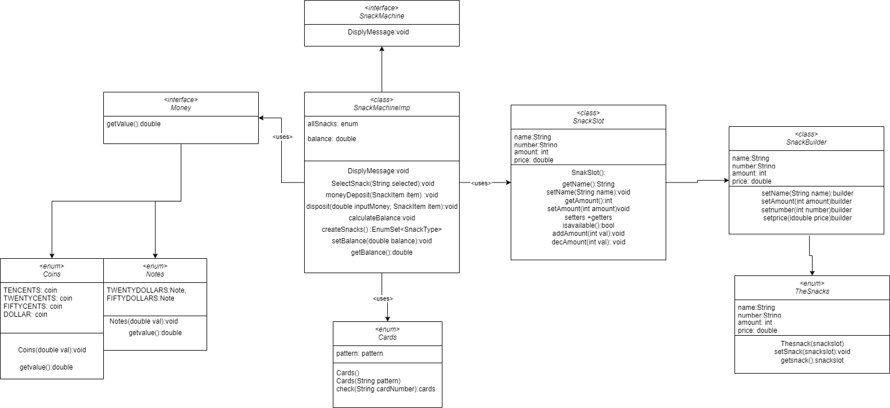
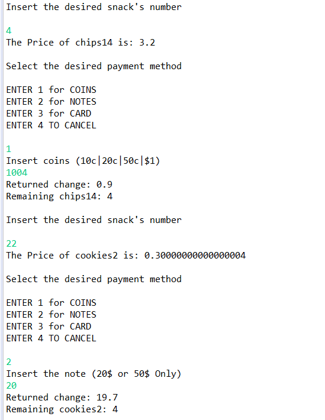

 
### Java implementation

### Alternative Flow
1. The use case begins when the customer wants to purchase snacks.
2. The customer selects a number by pressing on the keypad.
3. The VM displays a message that the snack is not available for the selected number or that the number was invalid and
asks to select another snack.

 
### UML Diagram

### Test case

